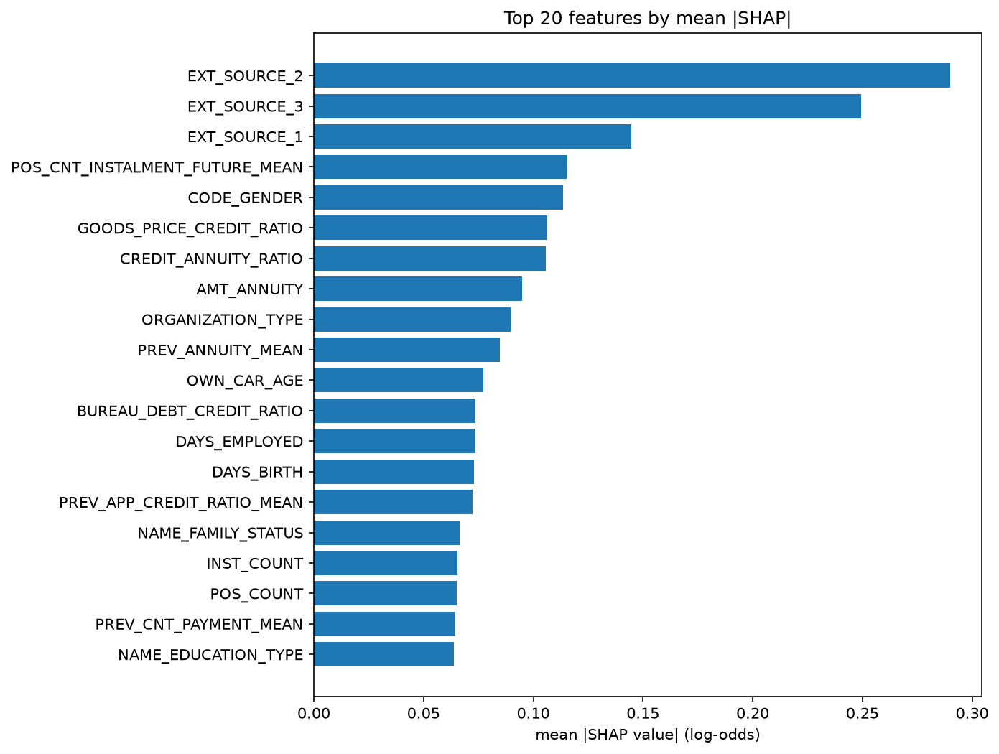
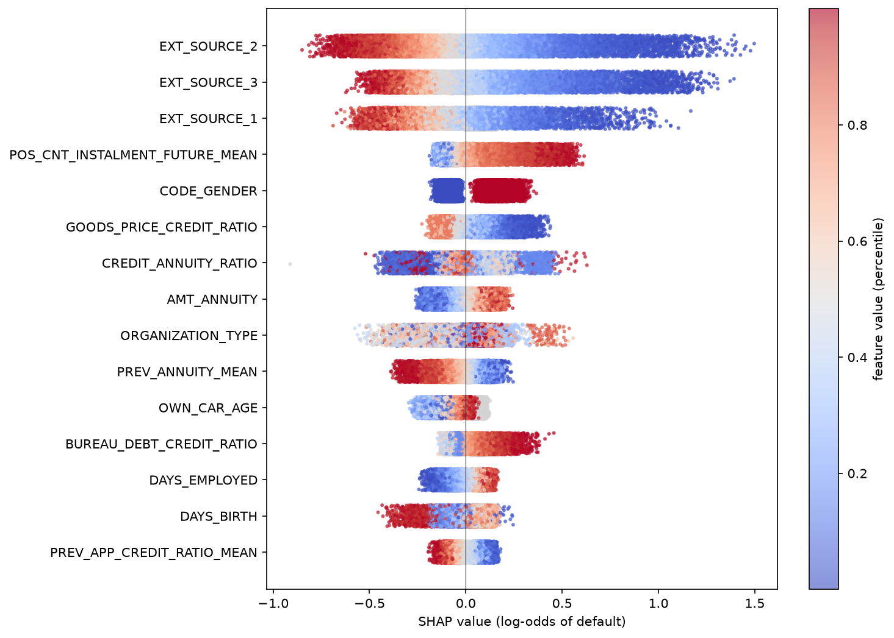
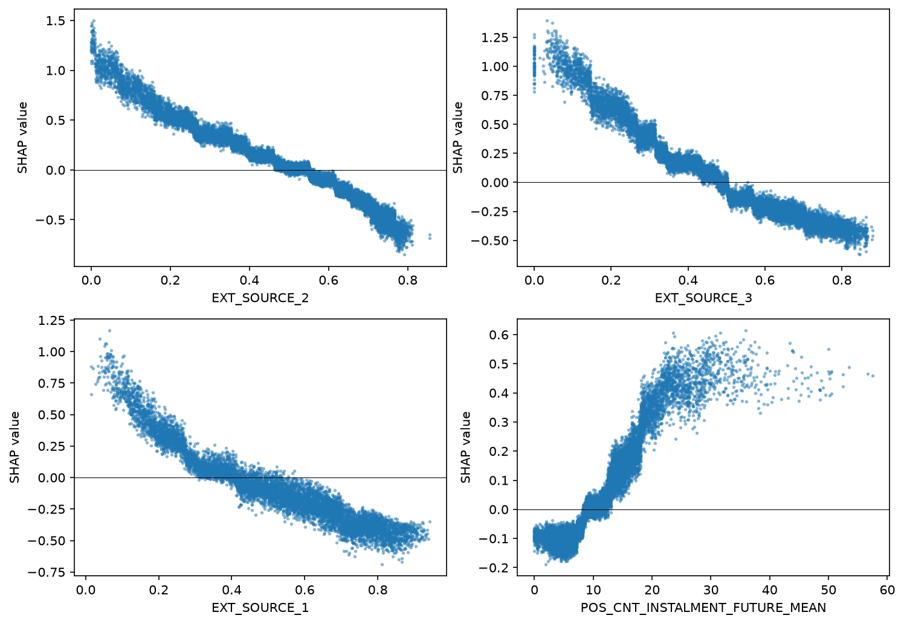

# Home Credit Default Risk: credit scoring with LightGBM

A study project based on the Kaggle competition
[Home Credit Default Risk](https://www.kaggle.com/c/home-credit-default-risk):
predict the probability that a loan applicant will have repayment difficulties.

**Status:** work in progress. Six of the seven data tables are used
(`bureau_balance` was dropped after the ablation); hyperparameters were tuned
with Optuna and the final model was analysed with SHAP.

## Goal

Learn the practical tabular-ML workflow on a realistic credit-risk problem:
feature engineering, reliable cross-validation, gradient boosting and model
interpretation. The approach is built step by step, and every change is
measured against the previous version.

## Data

- Source: Kaggle competition data (not included in this repository, see
  "How to run").
- Main table: `application_train.csv`, about 307k applications, binary target
  `TARGET` (1 = payment difficulties). The classes are heavily imbalanced
  (roughly 8% positives).
- Seven related tables in total (bureau history, previous applications,
  instalments, card balances). All except `bureau_balance` are used (see the ablation section).

## Method

- **Model:** LightGBM (`LGBMClassifier`), native handling of categorical columns
  and missing values.
- **Validation:** stratified 5-fold CV with a fixed seed (the same folds in every
  experiment), early stopping on AUC with a patience of 100 rounds.
- **Metric:** ROC AUC (the competition metric). The reported numbers are the mean
  and standard deviation over the folds; OOF AUC is computed on the pooled
  out-of-fold predictions.
- **Preprocessing:** the placeholder value `365243` in `DAYS_EMPLOYED` is replaced
  with NaN; string columns are cast to `category`.

Main hyperparameters: `learning_rate=0.05`, `num_leaves=31`, `subsample=0.8`,
`colsample_bytree=0.8`, `reg_lambda=1.0`, up to 5000 trees (early stopping decides
the real number). These defaults were used in the experiments above; tuned values
are given in the "Hyperparameter tuning" section.

## Results

| # | Experiment | CV AUC (mean ± std) | OOF AUC |
|---|------------|---------------------|---------|
| 1 | Baseline: raw `application_train` columns only | 0.7593 ± 0.0046 | 0.7593 |
| 2 | + 5 ratio features (see below) | 0.7671 ± 0.0047 | 0.7671 |
| 3 | + EXT_SOURCE mean/min/max/std (cumulative) | 0.7672 ± 0.0039 | 0.7672 |
| 4 | + EXT_SOURCE product (cumulative) | 0.7668 ± 0.0042 | 0.7668 |
| 5 | + EXT_SOURCE weighted mean (cumulative) | 0.7673 ± 0.0041 | 0.7673 |
| 6 | + EXT_SOURCE missing count (cumulative) | 0.7669 ± 0.0043 | 0.7669 |
| 7 | + bureau / bureau_balance aggregates (on top of 2) | 0.7732 ± 0.0039 | 0.7732 |
| 8 | + previous_application aggregates (on top of 7) | 0.7781 ± 0.0034 | 0.7780 |
| 9 | + installments_payments aggregates (on top of 8) | 0.7829 ± 0.0024 | 0.7829 |
| 10 | + POS_CASH_balance aggregates (on top of 9) | 0.7846 ± 0.0034 | 0.7846 |
| 11 | + credit_card_balance aggregates (on top of 10) | 0.7872 ± 0.0029 | 0.7871 |

Rows 3-6 add feature groups one after another on top of experiment 2. None of them
gave a stable gain (mean differences between consecutive steps are between -0.0004
and +0.0005, within the noise), so all external-score combinations were discarded
and experiment 2 remains the working feature set.

Experiment 7 is built on experiment 2 (not on 3-6). Compared with experiment 2 it
adds **+0.0061 CV AUC** and is better in 5 of 5 folds, so it is kept. Cumulative gain
over the raw baseline is about +0.014.

Experiment 8 adds the `previous_application` aggregates on top of experiment 7:
**+0.0048 CV AUC**, better in 5 of 5 folds, so it is kept (about +0.019 over the raw
baseline in total).

Experiment 9 adds the `installments_payments` aggregates on top of experiment 8:
**+0.0049 CV AUC**, better in 5 of 5 folds, so it is kept (about +0.024 over the raw
baseline in total).

Experiment 10 adds `POS_CASH_balance`: +0.0017 CV AUC, better in 4 of 5 folds. This
is below the 0.002-0.003 noise threshold, so the gain is not convincing; whether to
keep these features has to be decided by an ablation (run without them and compare).
Experiment 11 adds `credit_card_balance` on top: +0.0026, again better in 4 of 5
folds, a borderline gain. With all tables the pipeline reaches 0.7872 CV AUC, about
+0.028 over the raw baseline.

The ratio features add about **+0.0078 CV AUC**. The fold-to-fold standard deviation
is about 0.005, but all experiments share the same folds, so the comparison is
paired. Differences below roughly 0.002-0.003 are treated as noise.

Ratio features used in experiment 2:

- `CREDIT_INCOME_RATIO`: credit amount / income
- `ANNUITY_INCOME_RATIO`: annuity / income
- `CREDIT_ANNUITY_RATIO`: credit amount / annuity (approximate loan term)
- `GOODS_PRICE_CREDIT_RATIO`: goods price / credit amount
- `EMPLOYED_BIRTH_RATIO`: days employed / age in days

## Ablation

**Round 1 (with `bureau_balance` in the pipeline).** Each feature group was removed
in turn from the full model (CV AUC 0.7872, 198
features) and the CV was re-run with the same folds, so every difference is a paired
comparison. This measures the marginal contribution of a group given all the others.

| Group removed | Features | CV AUC without it | Change | Folds worse |
|---------------|----------|-------------------|--------|-------------|
| `bureau` | 13 | 0.7844 | -0.0029 | 5/5 |
| `installments_payments` | 12 | 0.7844 | -0.0028 | 5/5 |
| ratio features | 5 | 0.7846 | -0.0027 | 5/5 |
| `credit_card_balance` | 17 | 0.7846 | -0.0026 | 4/5 |
| `previous_application` | 16 | 0.7847 | -0.0025 | 5/5 |
| `POS_CASH_balance` | 12 | 0.7861 | -0.0011 | 4/5 |
| `bureau_balance` | 3 | 0.7871 | -0.0001 | 4/5 |
| `POS_CASH_balance` + `bureau_balance` together | 15 | 0.7857 | -0.0015 | 5/5 |

- Five groups contribute about 0.0025-0.0029 each. Their contribution in the full
  model is smaller than the gain they gave when they were first added (for example
  `bureau`: +0.0061 when added, -0.0029 when removed from the full model), because
  the groups partly carry overlapping information about the client's credit history.
- `bureau_balance` has a negligible effect (-0.0001) although it is the heaviest part
  of the pipeline (about 27M rows). It is the obvious candidate to drop for a lighter
  pipeline. `POS_CASH_balance` adds a little (-0.0011 when removed).
- Removing both weak groups together costs -0.0015 and is worse in all 5 folds,
  slightly more than the sum of the individual effects (-0.0012). The effect is small
  but consistent. Decision: `bureau_balance` is dropped from the final pipeline (the
  heaviest table, no measurable gain), `POS_CASH_balance` is kept. All numbers in the
  results and ablation tables above were measured before this change.

**Round 2 (final pipeline, without `bureau_balance`, 195 features).** The same
ablation on the final feature set, whose CV AUC is 0.7871 (seed 42):

| Group removed | Features | CV AUC without it | Change | Folds worse |
|---------------|----------|-------------------|--------|-------------|
| ratio features | 5 | 0.7839 | -0.0032 | 5/5 |
| `installments_payments` | 12 | 0.7842 | -0.0029 | 5/5 |
| `bureau` | 13 | 0.7843 | -0.0029 | 5/5 |
| `previous_application` | 16 | 0.7848 | -0.0024 | 5/5 |
| `credit_card_balance` | 17 | 0.7849 | -0.0022 | 5/5 |
| `POS_CASH_balance` | 12 | 0.7857 | -0.0014 | 5/5 |

Every remaining group hurts the model in all 5 folds when removed, by 0.0014-0.0032.
`POS_CASH_balance`, which looked like a candidate to drop in round 1, now shows a
consistent loss (-0.0014 in 5 of 5 folds), so it stays. The five ratio features are
the most valuable group per feature.

## Hyperparameter tuning

Optuna (TPE sampler, median pruner) searched seven LightGBM parameters on the final
feature set: `num_leaves`, `min_child_samples`, `colsample_bytree`, `subsample`,
`reg_alpha`, `reg_lambda` and `cat_smooth`. The search used a learning rate of 0.1
for speed and ran 120 trials in three runs of 40 (each run continued the same study; many trials
were pruned early). The first trial was a configuration close to the defaults, as a
reference.

Best parameters:

| Parameter | Value |
|-----------|-------|
| `num_leaves` | 16 |
| `min_child_samples` | 251 |
| `colsample_bytree` | 0.842 |
| `subsample` | 0.867 |
| `reg_alpha` | 7.99 |
| `reg_lambda` | 13.2 |
| `cat_smooth` | 76.0 |

The best search score (0.7890 at learning rate 0.1) is the maximum over many trials
on the same folds, so it is optimistic. The fair comparison uses a new fold split
(seed 2024) and the final learning rate 0.05:

| Parameters | CV AUC | OOF AUC |
|------------|--------|---------|
| Default | 0.7873 ± 0.0027 | 0.7873 |
| Tuned | 0.7896 ± 0.0023 | 0.7896 |

Tuning adds **+0.0024 CV AUC**, better in 5 of 5 folds. The estimate did not improve
with more trials: after 40, 80 and 120 trials the gain on the new split was +0.0022,
+0.0026 and +0.0024, which is within the noise, even though the best search score kept
creeping up (it is a maximum over trials and does not carry over). The best
configurations use small trees (`num_leaves` at the lower edge of the search range)
and strong regularization, which is consistent with a problem with a weak signal.
Tuning gives a smaller gain than adding the data tables did (roughly +0.005 for each
of the three largest ones).

## Model interpretation (SHAP)

SHAP values come from LightGBM's built-in `pred_contrib` and are given in log-odds of
default (positive values push a client towards higher risk). They were computed for
the final model (tuned parameters, 900 trees at learning rate 0.05, trained on all
rows) on a random sample of 20,000 training rows, so they describe how the model
behaves, not how it generalizes. The contributions add up to the raw model score to
floating-point precision (maximum error about 3e-14).





Findings:

- **The external scores dominate.** Mean |SHAP| is 0.29, 0.25 and 0.14 for
  `EXT_SOURCE_2`, `EXT_SOURCE_3` and `EXT_SOURCE_1`, more than twice the next feature
  (0.115). The effect is monotonic: the contribution falls from about +1.2 log-odds at
  a score near 0 to about -0.5 at a score of 0.8. For `EXT_SOURCE_3` there is also a
  separate group of clients with a score of exactly 0 and a high risk contribution;
  whether this is a real value or a data artifact has not been checked.
- **Remaining instalments matter.** `POS_CNT_INSTALMENT_FUTURE_MEAN` (average number
  of remaining instalments on previous point-of-sale and cash loans) is the 4th
  feature. Its contribution rises from about -0.1 below roughly 8 remaining
  instalments to about +0.5 at 25-30 and then flattens. This is the feature behind the
  small gain of `POS_CASH_balance` in the ablation.
- **Direction of the other effects** agrees with intuition in most cases: a higher
  current annuity, a shorter employment history, a higher debt-to-credit ratio at other
  institutions (`BUREAU_DEBT_CREDIT_RATIO`) and a credit much larger than the goods
  price (low `GOODS_PRICE_CREDIT_RATIO`) all increase the predicted risk. A higher
  average annuity on previous loans (`PREV_ANNUITY_MEAN`) goes the other way: clients
  who handled larger payments before look safer.
- **`CODE_GENDER` ranks 5th by SHAP (0.113)** although it was not in the top 20 by
  gain in the importance lists above. The beeswarm shows two clear clusters, one
  category with a negative and one with a positive contribution; with categories in
  alphabetical order (F, M, XNA) the higher-risk cluster appears to be M. In EU credit
  decisions gender-based treatment is restricted by equal-treatment rules, so a
  production model would need a legal and fairness review, including a check of how
  much predictive power is lost without this feature. Here it is a public competition
  dataset used for learning.

SHAP and gain importance give different rankings (for example `EXT_SOURCE_2` is ahead
of `EXT_SOURCE_3` by SHAP and behind it by gain), another reason to use more than one
view of importance.

## Observations

- The external scores `EXT_SOURCE_1/2/3` dominate the gain-based importance, with
  `EXT_SOURCE_3` and `EXT_SOURCE_2` clearly in front.
- `CREDIT_ANNUITY_RATIO` is the most important engineered feature and ranks above
  most raw columns.
- Without the ratio features, importance shifts to the raw columns they are built
  from (`AMT_CREDIT`, `AMT_GOODS_PRICE`, `AMT_ANNUITY`, `DAYS_EMPLOYED`). The trees
  partly approximate the missing ratios, which is why importance alone is not a
  reliable measure of a feature's contribution. Ablation (CV with and without a
  feature group) is used instead.
- Gain importance is biased towards high-cardinality categorical features such as
  `ORGANIZATION_TYPE`, so its high rank should be read with caution.
- Combinations of the external scores are a negative result: after adding them,
  `EXT_SOURCE_MEAN` became the most important feature by gain (and the importance of
  `EXT_SOURCE_3` dropped about fivefold), yet CV AUC did not improve. The trees simply
  switched to a new feature that carries the same information as the three originals.
  This is another example of why feature importance is not evidence of a real gain.
- The `bureau` aggregates are a real gain. Several of them (`BUREAU_DEBT_CREDIT_RATIO`,
  `BUREAU_DAYS_CREDIT_MAX`, `BUREAU_MAX_OVERDUE_MAX`) rank in the top 15 by gain while
  the importance of the external scores stays at a similar level, so the new features
  add information instead of replacing existing ones. None of the monthly-status
  (`BUREAU_BB_*`) features reached the top 20; their contribution turned
  out to be negligible (see the ablation section).
- The `previous_application` aggregates are also a real gain, although smaller than
  the `bureau` one (+0.0048 vs +0.0061): each additional table adds less. Eight new
  features reached the top 20 by gain, led by `PREV_APP_CREDIT_RATIO_MEAN` (ratio of
  requested to granted amount), followed by `PREV_CNT_PAYMENT_MEAN`,
  `PREV_ANNUITY_MEAN` and `PREV_REFUSED_SHARE`. The fold-to-fold standard deviation
  of CV AUC decreased from 0.0039 to 0.0034.
- The `installments_payments` aggregates add a similar gain (+0.0049), so the gain
  per table has stayed roughly constant (+0.0061, +0.0048, +0.0049). The standard
  deviation across folds dropped further, from 0.0034 to 0.0024. The recent-window
  feature `INST_DPD_MEAN_RECENT` (average days past due over the last year) ranks 9th
  by gain, ahead of `DAYS_BIRTH`, while the all-time `INST_DPD_MEAN` is not in the top
  20: recent payment behaviour appears more informative than the full history.
  `INST_LATE_SHARE` is also in the top 20.
- The last two tables show diminishing returns: +0.0017 (`POS_CASH_balance`) and
  +0.0026 (`credit_card_balance`) against roughly +0.005 for each of the three tables
  before. Only about 104k clients have credit card records, compared with about 340k
  for most other tables, which limits what this table can add.
  `POS_CNT_INSTALMENT_FUTURE_MEAN` ranks 9th by gain after the `POS_CASH_balance` step
  even though that step's CV gain is small, another reminder that importance is not
  the same as gain.

## How to run

1. Create an environment and install dependencies:
   ```bash
   pip install lightgbm scikit-learn pandas numpy optuna matplotlib
   ```
2. Download the competition data (requires a Kaggle account, an API token and
   accepting the competition rules):
   ```bash
   kaggle competitions download -c home-credit-default-risk
   ```
   Unzip it into `data/` (this folder is git-ignored).
3. Run `baseline.py` top to bottom. It is a plain Python script with `# %%` cells,
   so it also works as a notebook in VS Code or Jupyter.

## Roadmap

- [x] Combinations of the external scores (mean, min, max, std, product, weighted
      mean, missing count): no gain, discarded
- [x] Aggregates from `bureau` and `bureau_balance` (+0.0061 CV AUC)
- [x] Aggregates from `previous_application` (+0.0048 CV AUC)
- [x] Aggregates from `installments_payments` (+0.0049 CV AUC)
- [x] Aggregates from `POS_CASH_balance` (+0.0017 CV AUC, below the noise threshold)
- [x] Aggregates from `credit_card_balance` (+0.0026 CV AUC, borderline)
- [x] Hyperparameter tuning (Optuna): +0.0024 CV AUC on a new fold split
- [x] Model interpretation with SHAP
- [ ] Feature aggregation in SQL (DuckDB) as an alternative to Pandas
- [x] Ablation study per feature group

## References

This project is a learning exercise. The following public work is used as study
material and is not my own:

- [LightGBM with Simple Features](https://www.kaggle.com/code/jsaguiar/lightgbm-with-simple-features) (Kaggle notebook)
- [NoxMoon/home-credit-default-risk](https://github.com/NoxMoon/home-credit-default-risk)
  (simplified version of a gold-medal solution)
- [1st place solution write-up](https://www.kaggle.com/competitions/home-credit-default-risk/writeups/home-aloan-1st-place-solution)